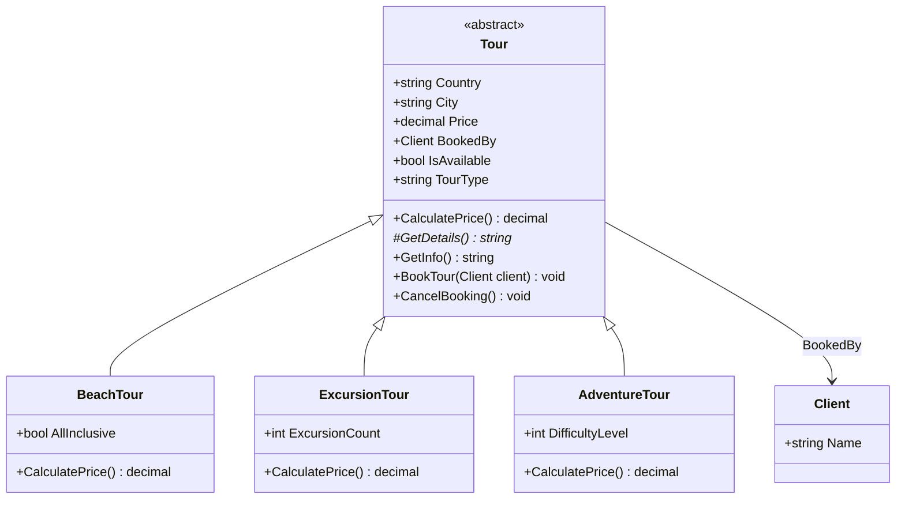

# Лабораторна робота №03

## Успадкування та поліморфізм у C#

- **Студент:** Василівський Артем, група КН1-Б25
- **Варіант:** 6 — Туристична агенція
- **Проєкт:** TravelApp

## Мета роботи

Набути практичних навичок використання механізмів успадкування та поліморфізму в об'єктно-орієнтованих програмах мовою C#. Навчитися створювати ієрархії класів, визначати спільні характеристики та поведінку базових класів, розширювати їх у похідних класах, а також використовувати ключові слова `virtual`, `override` та `abstract` для реалізації поліморфної поведінки об'єктів. Сформувати вміння проєктувати взаємопов'язані класи з урахуванням принципів повторного використання коду, розширюваності та підтримуваності програмного забезпечення.

## Завдання

Проєкт: вдосконалення програми обліку туристичних пропозицій та клієнтів.

1. **Створення ієрархії турів.** Розробити базовий клас `Tour` та похідні класи `BeachTour`, `ExcursionTour`, `AdventureTour`.
2. **Розрахунок вартості туру.** Створити віртуальний метод `CalculatePrice()` та реалізувати різні алгоритми його роботи для кожного типу туру.
3. **Поліморфна система турів.** Створити `List<Tour>` та розробити механізм обробки туристичних пропозицій через базовий тип.

## Хід виконання

### 1. Ієрархія турів



Клас `Tour` став абстрактним базовим класом. У ньому лишилося все спільне, що було створено в лабораторній роботі №2: країна, місто, базова ціна з перевірками, бронювання й керування станом. Похідні класи отримують це через успадкування й додають лише свої особливості.

- Конструктор `Tour` має модифікатор `protected`: його викликають тільки похідні класи через `base(...)`.
- `TourType` і `GetDetails()` — абстрактні члени: базовий клас не знає, як їх реалізувати, тому кожен похідний клас зобов'язаний їх визначити.
- `CalculatePrice()` — віртуальний метод з базовою реалізацією (повертає базову ціну), яку похідні класи перевизначають.
- `GetInfo()` — звичайний метод, спільний для всіх турів. Він викликає `TourType`, `GetDetails()` і `CalculatePrice()`, а ті виконуються з того класу, яким є об'єкт насправді.

Файл `Models/Tour.cs`:

```csharp
namespace TravelApp.Models;

/// <summary>
/// Базовий абстрактний клас туристичної пропозиції.
/// Містить спільні для всіх турів дані, перевірки й бронювання.
/// Створити «просто тур» не можна — лише конкретний тип: пляжний, екскурсійний чи пригодницький.
/// </summary>
public abstract class Tour
{
    private string _country = string.Empty;
    private string _city = string.Empty;
    private decimal _price;

    /// <summary>
    /// Конструктор protected: його викликають лише похідні класи через base(...).
    /// </summary>
    protected Tour(string country, string city, decimal price)
    {
        Country = country;
        City = city;
        Price = price;
    }

    public string Country
    {
        get => _country;
        set => _country = RequireText(value, "Країна");
    }

    public string City
    {
        get => _city;
        set => _city = RequireText(value, "Місто");
    }

    /// <summary>
    /// Базова ціна туру, грн. Повинна бути більшою за нуль.
    /// </summary>
    public decimal Price
    {
        get => _price;
        set
        {
            if (value <= 0)
            {
                throw new ArgumentException("Ціна туру повинна бути більшою за нуль.");
            }

            _price = value;
        }
    }

    public Client? BookedBy { get; private set; }

    public bool IsAvailable => BookedBy is null;

    /// <summary>
    /// Назва типу туру. Абстрактна: кожен похідний клас зобов'язаний її визначити.
    /// </summary>
    public abstract string TourType { get; }

    /// <summary>
    /// Підсумкова вартість туру. Віртуальна: базовий алгоритм повертає базову ціну,
    /// а похідні класи перевизначають його (override).
    /// </summary>
    public virtual decimal CalculatePrice()
    {
        return Price;
    }

    /// <summary>
    /// Особливості конкретного туру. Абстрактний метод без реалізації в базовому класі.
    /// </summary>
    protected abstract string GetDetails();

    /// <summary>
    /// Спільний для всіх турів формат опису. Метод один, але TourType, GetDetails()
    /// і CalculatePrice() викликаються з того класу, яким є об'єкт насправді.
    /// </summary>
    public string GetInfo()
    {
        string status = BookedBy is null ? "доступний" : $"заброньовано: {BookedBy.Name}";
        return $"{TourType}: {Country}, {City} ({GetDetails()}) – {CalculatePrice():0.##} грн [{status}]";
    }

    public void BookTour(Client client)
    {
        ArgumentNullException.ThrowIfNull(client);

        if (!IsAvailable)
        {
            throw new InvalidOperationException($"Тур «{Country}, {City}» уже заброньовано.");
        }

        BookedBy = client;
    }

    public void CancelBooking()
    {
        if (IsAvailable)
        {
            throw new InvalidOperationException($"Тур «{Country}, {City}» не заброньовано, скасовувати нічого.");
        }

        BookedBy = null;
    }

    private static string RequireText(string value, string fieldName)
    {
        if (string.IsNullOrWhiteSpace(value))
        {
            throw new ArgumentException($"Поле «{fieldName}» не може бути порожнім.");
        }

        return value.Trim();
    }
}
```

### 2. Розрахунок вартості туру

Кожен похідний клас перевизначає `CalculatePrice()` (`override`) і бере за основу результат базового методу `base.CalculatePrice()`.

| Клас | Додаткова властивість | Алгоритм `CalculatePrice()` | Приклад |
|---|---|---|---|
| `BeachTour` | `AllInclusive` | базова ціна + 30 % за «все включено» | 28 500 + 8 550 = 37 050 грн |
| `ExcursionTour` | `ExcursionCount` (від 1) | базова ціна + 800 грн за кожну екскурсію | 42 300 + 3 × 800 = 44 700 грн |
| `AdventureTour` | `DifficultyLevel` (1–3) | базова ціна + 10 % за кожен рівень складності + страховка 1500 грн | 9 800 + 1 960 + 1 500 = 13 260 грн |

Нові властивості похідних класів теж інкапсульовані й перевіряються: кількість екскурсій не може бути меншою за 1, а рівень складності — виходити за межі 1–3.

Файл `Models/BeachTour.cs`:

```csharp
namespace TravelApp.Models;

/// <summary>
/// Пляжний тур. Опція «все включено» додає 30 % до базової ціни.
/// </summary>
public class BeachTour : Tour
{
    private const decimal AllInclusiveMarkup = 0.30m;

    public BeachTour(string country, string city, decimal price, bool allInclusive)
        : base(country, city, price)
    {
        AllInclusive = allInclusive;
    }

    public bool AllInclusive { get; set; }

    public override string TourType => "Пляжний тур";

    public override decimal CalculatePrice()
    {
        decimal price = base.CalculatePrice();
        return AllInclusive ? price + price * AllInclusiveMarkup : price;
    }

    protected override string GetDetails()
    {
        return AllInclusive ? "все включено" : "лише проживання";
    }
}
```

Файл `Models/ExcursionTour.cs`:

```csharp
namespace TravelApp.Models;

/// <summary>
/// Екскурсійний тур. Кожна екскурсія з гідом коштує 800 грн понад базову ціну.
/// </summary>
public class ExcursionTour : Tour
{
    private const decimal ExcursionFee = 800m;
    private int _excursionCount;

    public ExcursionTour(string country, string city, decimal price, int excursionCount)
        : base(country, city, price)
    {
        ExcursionCount = excursionCount;
    }

    public int ExcursionCount
    {
        get => _excursionCount;
        set
        {
            if (value < 1)
            {
                throw new ArgumentException("Екскурсійний тур повинен містити хоча б одну екскурсію.");
            }

            _excursionCount = value;
        }
    }

    public override string TourType => "Екскурсійний тур";

    public override decimal CalculatePrice()
    {
        return base.CalculatePrice() + ExcursionCount * ExcursionFee;
    }

    protected override string GetDetails()
    {
        return $"екскурсій: {ExcursionCount}";
    }
}
```

Файл `Models/AdventureTour.cs`:

```csharp
namespace TravelApp.Models;

/// <summary>
/// Пригодницький тур. Кожен рівень складності додає 10 % до базової ціни,
/// а обов'язкова страховка — ще 1500 грн.
/// </summary>
public class AdventureTour : Tour
{
    private const decimal DifficultyMarkup = 0.10m;
    private const decimal InsuranceFee = 1500m;
    private int _difficultyLevel;

    public AdventureTour(string country, string city, decimal price, int difficultyLevel)
        : base(country, city, price)
    {
        DifficultyLevel = difficultyLevel;
    }

    /// <summary>
    /// Рівень складності від 1 до 3.
    /// </summary>
    public int DifficultyLevel
    {
        get => _difficultyLevel;
        set
        {
            if (value < 1 || value > 3)
            {
                throw new ArgumentException("Рівень складності повинен бути від 1 до 3.");
            }

            _difficultyLevel = value;
        }
    }

    public override string TourType => "Пригодницький тур";

    public override decimal CalculatePrice()
    {
        decimal price = base.CalculatePrice();
        return price + price * DifficultyMarkup * DifficultyLevel + InsuranceFee;
    }

    protected override string GetDetails()
    {
        return $"складність {DifficultyLevel} з 3, зі страховкою";
    }
}
```

### 3. Поліморфна система турів

У `Program.cs` створено список `List<Tour>`, у якому зберігаються об'єкти всіх трьох похідних класів. Функції `PrintTours()`, `CalculateTotal()` і `FindCheapestAvailable()` працюють лише з базовим типом `Tour` і нічого не знають про конкретні класи, але для кожного туру викликається його власна реалізація `CalculatePrice()` і `GetDetails()`. Бронювання також виконується через посилання на базовий тип.

```csharp
using TravelApp.Models;

// Щоб українські літери (і, ї, є, ґ) правильно відображалися в консолі Windows
Console.OutputEncoding = System.Text.Encoding.UTF8;

Client client1 = new() { Name = "Олександр Бондаренко" };
Client client2 = new() { Name = "Катерина Литвин" };

// Поліморфна колекція: список має тип базового класу Tour,
// а зберігає об'єкти різних похідних класів
List<Tour> tours = new List<Tour>
{
    new BeachTour("Туреччина", "Анталія", 28500, allInclusive: true),
    new BeachTour("Греція", "Крит", 34000, allInclusive: false),
    new ExcursionTour("Італія", "Рим", 42300, excursionCount: 3),
    new AdventureTour("Україна", "Яремче", 9800, difficultyLevel: 2)
};

PrintTours("Туристичні пропозиції:", tours);
Console.WriteLine($"Разом за всіма турами: {CalculateTotal(tours):0.##} грн");

// Бронювання через посилання на базовий тип Tour
tours[0].BookTour(client1);
tours[2].BookTour(client2);
PrintTours("\nПісля бронювання:", tours);

Tour? cheapest = FindCheapestAvailable(tours);
if (cheapest is not null)
{
    Console.WriteLine("\nНайдешевший із доступних турів:");
    Console.WriteLine(cheapest.GetInfo());
}

// Перевірки працюють і в базовому класі, і в похідних
Console.WriteLine("\nПеревірка некоректних даних:");

try
{
    Tour wrongTour = new ExcursionTour("Франція", "Париж", 39000, excursionCount: 0);
}
catch (ArgumentException ex)
{
    Console.WriteLine($"Помилка: {ex.Message}");
}

try
{
    Tour wrongTour = new AdventureTour("Грузія", "Казбегі", 15000, difficultyLevel: 5);
}
catch (ArgumentException ex)
{
    Console.WriteLine($"Помилка: {ex.Message}");
}

try
{
    Tour wrongTour = new BeachTour("", "Шарм-ель-Шейх", 30000, allInclusive: true);
}
catch (ArgumentException ex)
{
    Console.WriteLine($"Помилка: {ex.Message}");
}

// Такий код не скомпілюється:
// Tour tour = new Tour("Італія", "Рим", 42300);   // CS0144: не можна створити об'єкт абстрактного класу

// Виводить усі тури списку. Для кожного викликається GetInfo() базового класу,
// а всередині нього — CalculatePrice() і GetDetails() конкретного типу туру.
static void PrintTours(string title, List<Tour> tourList)
{
    Console.WriteLine(title);
    foreach (Tour tour in tourList)
    {
        Console.WriteLine(tour.GetInfo());
    }
}

// Сумарна вартість: CalculatePrice() кожного туру викликається через базовий тип
static decimal CalculateTotal(List<Tour> tourList)
{
    decimal total = 0;
    foreach (Tour tour in tourList)
    {
        total += tour.CalculatePrice();
    }

    return total;
}

// Найдешевший тур серед доступних для бронювання
static Tour? FindCheapestAvailable(List<Tour> tourList)
{
    Tour? cheapest = null;
    foreach (Tour tour in tourList)
    {
        if (tour.IsAvailable && (cheapest is null || tour.CalculatePrice() < cheapest.CalculatePrice()))
        {
            cheapest = tour;
        }
    }

    return cheapest;
}
```

Обмеження ієрархії перевіряє компілятор:

| Код | Помилка компілятора |
|---|---|
| `Tour tour = new Tour("Італія", "Рим", 42300);` | CS0144: не можна створити об'єкт абстрактного класу |
| `tours[0].GetDetails();` | CS0122: метод захищений (`protected`) |
| `tours[0].IsAvailable = false;` | CS0200: властивість лише для читання |

## Структура проєкту

```text
oop-2026-vasylivskyi/
├── src/
│   └── TravelApp/
│       ├── Models/
│       │   ├── AdventureTour.cs
│       │   ├── BeachTour.cs
│       │   ├── Client.cs
│       │   ├── ExcursionTour.cs
│       │   └── Tour.cs
│       ├── Program.cs
│       └── TravelApp.csproj
├── docs/
│   ├── lab01/
│   │   └── report.md
│   ├── lab02/
│   │   └── report.md
│   └── lab03/
│       └── report.md
├── .gitignore
├── README.md
└── TravelApp.slnx
```

## Результат виконання

```text
Туристичні пропозиції:
Пляжний тур: Туреччина, Анталія (все включено) – 37050 грн [доступний]
Пляжний тур: Греція, Крит (лише проживання) – 34000 грн [доступний]
Екскурсійний тур: Італія, Рим (екскурсій: 3) – 44700 грн [доступний]
Пригодницький тур: Україна, Яремче (складність 2 з 3, зі страховкою) – 13260 грн [доступний]
Разом за всіма турами: 129010 грн

Після бронювання:
Пляжний тур: Туреччина, Анталія (все включено) – 37050 грн [заброньовано: Олександр Бондаренко]
Пляжний тур: Греція, Крит (лише проживання) – 34000 грн [доступний]
Екскурсійний тур: Італія, Рим (екскурсій: 3) – 44700 грн [заброньовано: Катерина Литвин]
Пригодницький тур: Україна, Яремче (складність 2 з 3, зі страховкою) – 13260 грн [доступний]

Найдешевший із доступних турів:
Пригодницький тур: Україна, Яремче (складність 2 з 3, зі страховкою) – 13260 грн [доступний]

Перевірка некоректних даних:
Помилка: Екскурсійний тур повинен містити хоча б одну екскурсію.
Помилка: Рівень складності повинен бути від 1 до 3.
Помилка: Поле «Країна» не може бути порожнім.
```

## Обґрунтування: навіщо успадкування та поліморфізм

- **Повторне використання коду.** Перевірки країни, міста й ціни, а також бронювання написано один раз у класі `Tour`, і всі три типи турів отримують їх без дублювання.
- **Розширюваність.** Щоб додати новий тип, наприклад круїз, достатньо створити клас `CruiseTour : Tour` зі своїми `CalculatePrice()` і `GetDetails()`. Функції обробки списку турів змінювати не доведеться.
- **Підтримуваність.** Кожен алгоритм розрахунку вартості лежить у своєму класі, тому зміна правил для пляжних турів не зачіпає екскурсійні чи пригодницькі.
- **Абстрактний базовий клас.** «Тур узагалі» в агенції не продається, тому `Tour` абстрактний: компілятор не дасть створити такий об'єкт і змусить кожен новий тип визначити назву й особливості.

## Висновки

Під час виконання лабораторної роботи я побудував ієрархію турів: абстрактний базовий клас `Tour` і похідні класи `BeachTour`, `ExcursionTour` та `AdventureTour`. Спільні дані, перевірки й бронювання винесено в базовий клас, а різні алгоритми розрахунку вартості реалізовано перевизначенням віртуального методу `CalculatePrice()`. Застосовано ключові слова `abstract`, `virtual`, `override`, `base` і `protected`. Список `List<Tour>` та функції його обробки демонструють поліморфізм: код працює з базовим типом, а виконується поведінка конкретного класу.
